# Portal Data Flow Map

This file is a short reference for the three main portal flows:
- Assessments
- Captured Notes
- Applicants

## Master Flow

```mermaid
flowchart TD
  A["User action / SSE event"] --> B["API mutation"]

  B --> C["Assessments path"]
  B --> D["Captured Notes path"]
  B --> E["Applicants path"]
  B --> F["Workspace reload path"]

  C --> C1["applyAssessmentChange(...)"]
  C1 --> C2["state.assessments"]
  C1 --> C3["assessmentListItems"]
  C1 --> C4["assessmentOptionPool"]
  C1 --> C5["assessmentStatsSnapshot"]
  C1 --> C6["sortAssessmentsForList(...)"]
  C1 --> C7["open assessment snapshot"]
  C --> C8["syncPostAssessmentMutation(...)"]
  C8 -. default .-> C9["candidate-row sync only"]
  C8 -. fallback only .-> C10["reloadAssessmentSlice(...)"]
  C8 -. fallback only .-> C11["reloadAssessmentStats(...)"]

  D --> D1["patchCandidateQuiet(...)"]
  D1 --> D2["state.candidates"]
  D1 --> D3["state.databaseCandidates"]
  D1 --> D4["capturedListItems"]
  D1 --> D5["capturedOptionPool"]
  D1 --> D6["sortCapturedNotesForList(...)"]
  D --> D7["hideCapturedCandidate(...) / restoreCapturedCandidate(...)"]
  D7 --> D4
  D7 --> D5
  D7 --> D8["capturedListMeta"]
  D --> D9["reloadCapturedSlice(...)"]
  D --> D10["reloadCapturedStats(...)"]

  E --> E1["applicant row patch"]
  E1 --> E2["state.applicants"]
  E1 --> E3["state.applicantListItems"]
  E1 --> E4["applicantStatsSnapshot"]
  E1 --> E5["sortApplicantsForList(...)"]
  E --> E6["reloadApplicantsSlice(...)"]
  E --> E7["reloadApplicantStats(...)"]

  F --> F1["loadWorkspace(...)"]
  F1 --> F2["database-candidates?limit=5000"]
```

## Quick Reading Guide

### Assessments
- `applyAssessmentChange(...)` updates the assessment cache and visible list.
- `sortAssessmentsForList(...)` keeps updated items in the correct order.
- `syncPostAssessmentMutation(...)` is now light by default.
- Heavy reload only happens through fallback:
  - `reloadAssessmentSlice(...)`
  - `reloadAssessmentStats(...)`

### Captured Notes
- `patchCandidateQuiet(...)` is the main local patch helper.
- `reloadCapturedSlice(...)` refreshes the visible captured list.
- `reloadCapturedStats(...)` refreshes counters.
- `loadWorkspace(...)` is the separate heavy path that can still load `database-candidates?limit=5000`.

### Applicants
- `applicant` row updates flow through the applicants caches.
- `reloadApplicantsSlice(...)` refreshes the visible slice.
- `reloadApplicantStats(...)` refreshes the counters.

## One-line summary

- Assessment uses a centralized change helper.
- Captured Notes and Applicants use local patch + slice reload helpers.
- The `5000` fetch belongs to workspace/database loading, not normal slice refresh.
